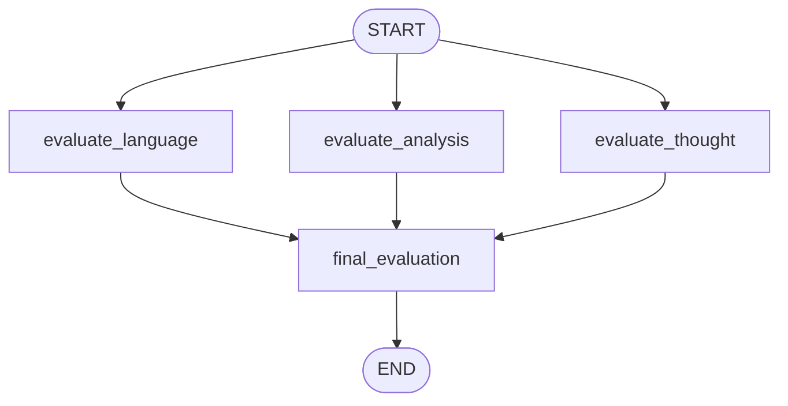

# LangGraph Portfolio

**9 projects that document my journey from "first graph" to a multi-agent
essay evaluator with parallel LLM critics, conditional routing, and
self-correcting loops.**

I built these to learn [LangGraph](https://langchain-ai.github.io/langgraph/),
LangChain's framework for building stateful, graph-based LLM applications.
The progression is deliberate — each project introduces one or two new
concepts on top of the previous one.

> **Live demo** of the flagship project: try the [UPSC Essay Evaluator](demos/README.md)
> in your browser.

---

## What this showcases

| Concept | Where you'll see it |
|---|---|
| `StateGraph`, `add_node`, `add_edge`, `START` / `END` | Every project |
| `add_conditional_edges` with a routing function | [04 Conditional Routing](projects/04-conditional-routing/), [07 Review Triage](projects/07-review-triage/) |
| Fan-out / fan-in (parallel edges from `START`) | [05 Parallel Evaluation](projects/05-parallel-evaluation/), [09 UPSC Essay](projects/09-upsc-essay-evaluator/) |
| `add_messages` reducer for multi-turn chat | [06 Chatbot with Memory](projects/06-chatbot-with-memory/) |
| `MemorySaver` checkpointing, `thread_id` | [06 Chatbot with Memory](projects/06-chatbot-with-memory/) |
| Pydantic structured output | [07 Review Triage](projects/07-review-triage/), [08 Tweet Loop](projects/08-tweet-generator-loop/), [09 UPSC Essay](projects/09-upsc-essay-evaluator/) |
| Loops with termination guards | [08 Tweet Generator Loop](projects/08-tweet-generator-loop/) |
| Custom `Annotated` reducers (`operator.add`, `replace_value`) | [05 Parallel Evaluation](projects/05-parallel-evaluation/), [08 Tweet Loop](projects/08-tweet-generator-loop/), [09 UPSC Essay](projects/09-upsc-essay-evaluator/) |

---

## Project progression

| # | Project | Concept | Run |
|---|---|---|---|
| 01 | [BMI Calculator](projects/01-bmi-calculator/) | Minimal 2-node graph (no LLM) | `python projects/01-bmi-calculator/bmi.py` |
| 02 | [Simple LLM Q&A](projects/02-simple-llm-qa/) | Single-node graph wrapping one LLM call | `python projects/02-simple-llm-qa/simple_llm.py` |
| 03 | [Prompt Chaining](projects/03-prompt-chaining/) | Sequential composition (outline → post) | `python projects/03-prompt-chaining/prompt_chain.py` |
| 04 | [Conditional Routing](projects/04-conditional-routing/) | `add_conditional_edges` — 3-way branch on discriminant | `python projects/04-conditional-routing/quadratic.py` |
| 05 | [Parallel Evaluation](projects/05-parallel-evaluation/) | Fan-out / fan-in with custom reducer | `python projects/05-parallel-evaluation/batsman.py` |
| 06 | [Chatbot with Memory](projects/06-chatbot-with-memory/) | `add_messages` + `MemorySaver` | `python projects/06-chatbot-with-memory/chatbot.py` |
| 07 | [Review Triage](projects/07-review-triage/) | Pydantic structured output + 2-way branch | `python projects/07-review-triage/review_triage.py` |
| 08 | [Tweet Generator Loop](projects/08-tweet-generator-loop/) | Self-correcting loop with `max_iterations` guard | `python projects/08-tweet-generator-loop/tweet_loop.py` |
| 09 | [UPSC Essay Evaluator](projects/09-upsc-essay-evaluator/) ⭐ | 3 parallel LLM critics + aggregator | `python projects/09-upsc-essay-evaluator/upsc_essay.py` |

---

## The flagship: UPSC Essay Evaluator

Three evaluators — *language*, *analysis*, and *clarity of thought* — run
**in parallel** from `START`, each emitting a structured score. A final
node aggregates the feedback and computes the average.



The same shape as a production multi-agent evaluator
(LLM-as-a-judge, [Constitutional AI](https://www.anthropic.com/news/claudes-constitution),
etc.): many specialised critics running concurrently, then aggregation.

**Try it without installing anything** — the Streamlit demo is in [`demos/`](demos/README.md).

---

## How to run locally

```bash
git clone <this-repo>
cd <this-repo>
pip install -r requirements.txt
cp .env.example .env        # then add your GROQ_API_KEY
```

Run any project directly:
```bash
python projects/09-upsc-essay-evaluator/upsc_essay.py
```

Or open the original notebook:
```bash
jupyter notebook projects/09-upsc-essay-evaluator/upsc_essay_workflow.ipynb
```

Run the live demo:
```bash
streamlit run demos/upsc_essay_app.py
```

---

## Repo structure

```
.
├── README.md                 ← you are here
├── requirements.txt
├── .env.example
├── .gitignore                ← .env and myenv/ are excluded
├── projects/
│   ├── 01-bmi-calculator/    ← each has README, .py, diagram, notebook
│   ├── 02-simple-llm-qa/
│   ├── 03-prompt-chaining/
│   ├── 04-conditional-routing/
│   ├── 05-parallel-evaluation/
│   ├── 06-chatbot-with-memory/
│   ├── 07-review-triage/
│   ├── 08-tweet-generator-loop/
│   └── 09-upsc-essay-evaluator/   ⭐ the flagship
└── demos/
    ├── README.md
    └── upsc_essay_app.py     ← Streamlit live demo
```

---

## Notes

- Each project folder is self-contained: a README, a clean `.py` script,
  the original `.ipynb`, and a Mermaid `diagram.md` you can open in any
  Markdown viewer.
- Folder names describe the **LangGraph concept** each one teaches, not
  the surface-level topic. (This is intentional — recruiters scan
  folder names before they read prose.)
- The `.env` file is git-ignored. Use `.env.example` as a template.
- The `myenv/` folder in the original workspace was an old venv — it's
  not part of the repo.

---

## Tech

- [LangGraph](https://langchain-ai.github.io/langgraph/) — graph orchestration
- [LangChain](https://python.langchain.com/) — LLM provider integrations
- [Groq](https://groq.com/) — fast LLM inference (used for most projects)
- [OpenRouter](https://openrouter.ai/) — alternate provider (project 02)
- [Pydantic](https://docs.pydantic.dev/) — structured output
- [Streamlit](https://streamlit.io/) — live demo
