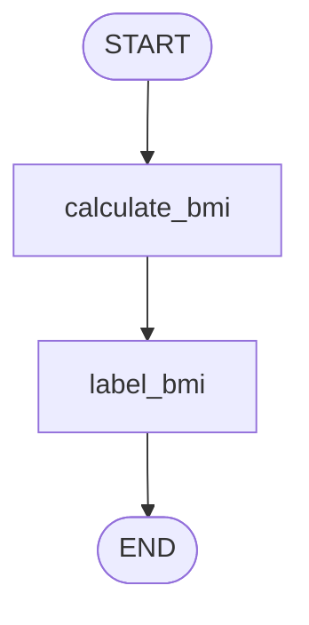

# BMI Calculator — Graph

```mermaid
graph TD
    START([START]) --> A[calculate_bmi]
    A --> B[label_bmi]
    B --> END([END])
```

**Pattern:** Linear two-node pipeline. The simplest possible `StateGraph` —
pure Python, no LLM.
