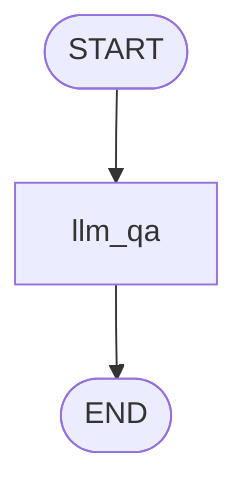

# Simple LLM Q&A — Graph

```mermaid
graph TD
    START([START]) --> A[llm_qa]
    A --> END([END])
```

**Pattern:** Single-node graph wrapping one LLM call. The minimal pattern
for any "ask the model" workflow.
