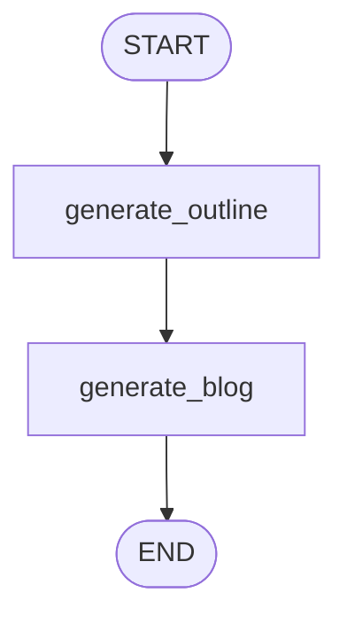

# Prompt Chaining — Graph

```mermaid
graph TD
    START([START]) --> A[generate_outline]
    A --> B[generate_blog]
    B --> END([END])
```

**Pattern:** Sequential chaining. The second node reads `outline` from
state, which was written by the first node — state as the data conduit.
