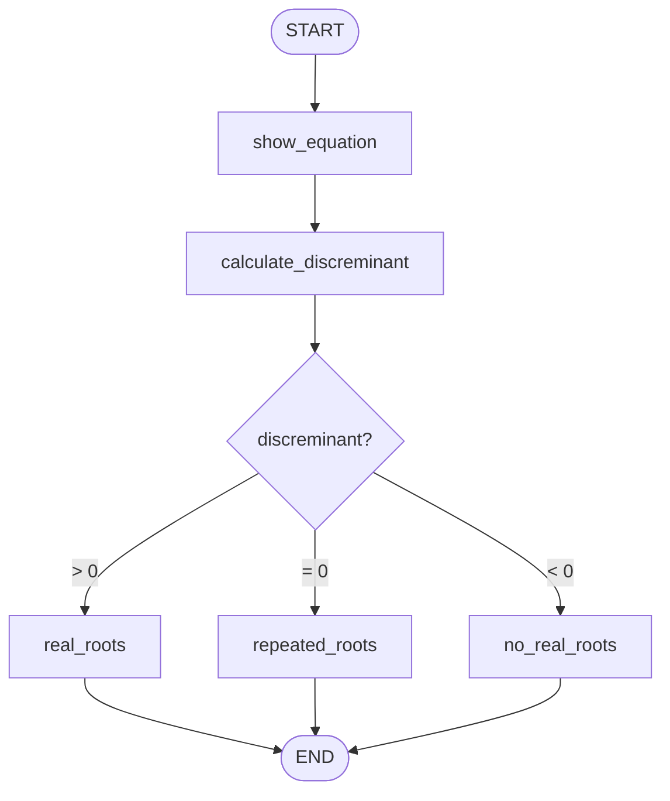

# Conditional Routing — Graph

```mermaid
graph TD
    START([START]) --> A[show_equation]
    A --> B[calculate_discreminant]
    B --> C{discreminant?}
    C -- "> 0" --> D[real_roots]
    C -- "= 0" --> E[repeated_roots]
    C -- "< 0" --> F[no_real_roots]
    D --> END([END])
    E --> END
    F --> END
```

**Pattern:** `add_conditional_edges` with a routing function. One routing
function dispatches to one of N branches based on runtime state.
