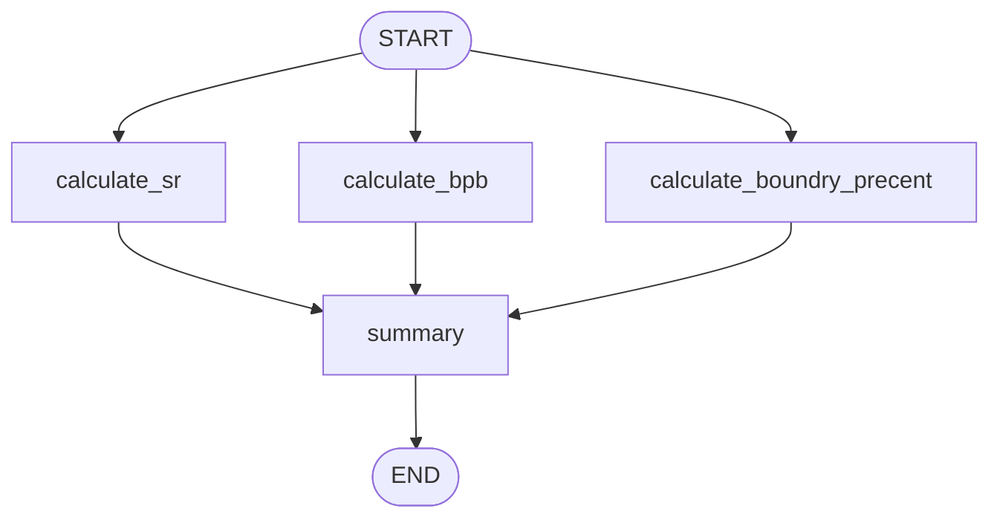

# Parallel Evaluation — Graph

**Pattern:** Fan-out + fan-in via multiple `START → node` edges. All three
metric nodes run in parallel; their results merge into a single summary
node. Uses a custom `replace_value` reducer so partial state is safe.
