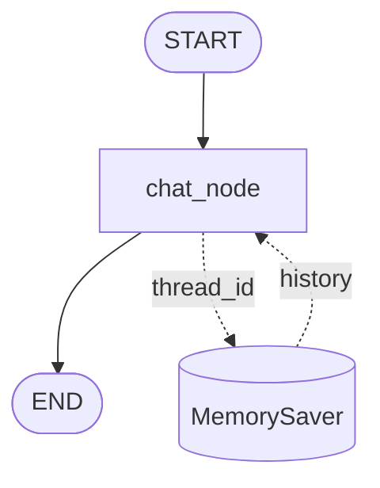

# Chatbot with Memory — Graph

**Pattern:** The standard multi-turn chatbot. `add_messages` reducer
appends new messages; `MemorySaver` checkpointer persists conversation
state across calls keyed by `thread_id`. (Dotted lines are not graph
edges — they show where the checkpointer lives outside the graph.)
