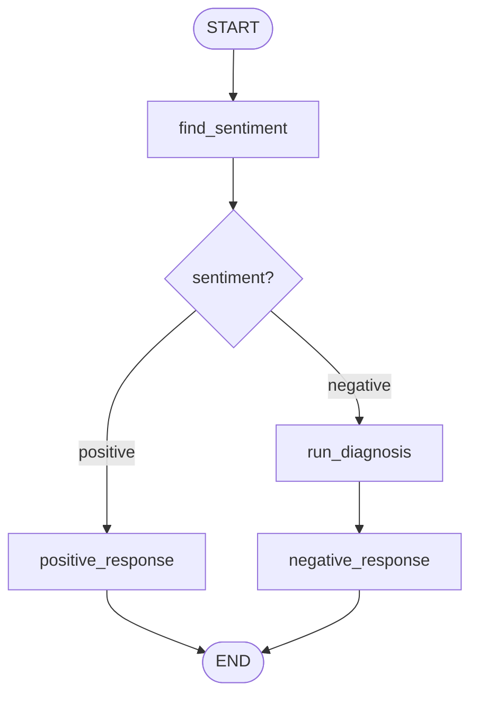

# Review Triage — Graph

```mermaid
graph TD
    START([START]) --> A[find_sentiment]
    A --> B{sentiment?}
    B -- "positive" --> C[positive_response]
    B -- "negative" --> D[run_diagnosis]
    D --> E[negative_response]
    C --> END([END])
    E --> END
```

**Pattern:** Pydantic-based structured output drives a 2-way branch.
Negative reviews get an extra diagnosis step before drafting a reply.
