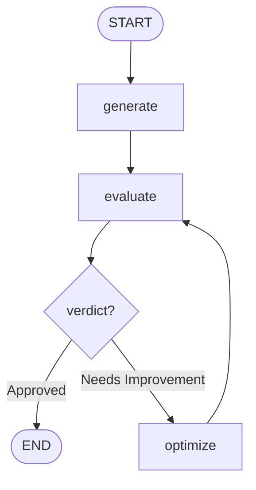

# Tweet Generator with Optimize Loop — Graph

**Pattern:** A self-correcting loop. A termination guard (`max_iterations`)
prevents infinite loops. Conditional routing decides: exit or feed back
through `optimize → evaluate` again.
