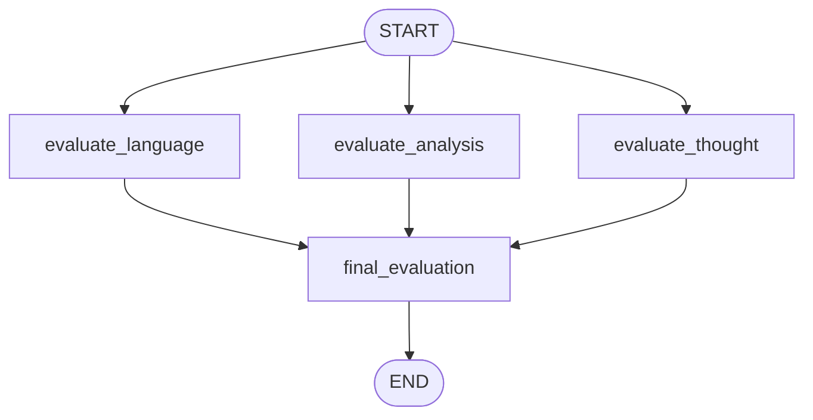

# UPSC Essay Evaluator — Graph (the flagship)

**Pattern:** Three evaluators run **in parallel** from `START`, each
emitting a structured score. Scores are merged using `operator.add`
on `individual_scores: list[float]`. A final aggregator node produces
the overall feedback and average score.

This is the same pattern as a real **multi-agent evaluator** (think
LLM-as-a-judge, or the [Anthropic Constitutional AI](https://www.anthropic.com/news/claudes-constitution)
approach): many specialised critics run in parallel, then aggregate.
